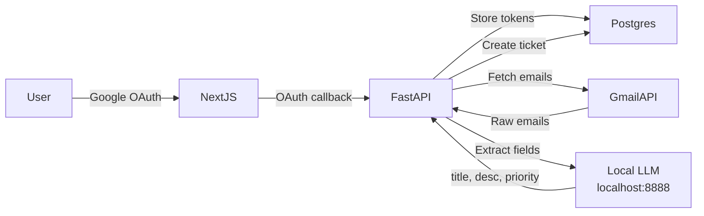

# Gmail Automation & Google OAuth Integration Plan

## Architecture Overview



---

## 1. Landing Page

Currently `frontend/app/page.js` is a redirect hub. It will become the landing page; login moves to its own route.

- **`frontend/app/page.js`** — Replace redirect logic with a marketing/landing page (hero section, features, CTA buttons to `/login` and `/register`). Unauthenticated users see the landing page; authenticated users get redirected to their home via `homeForUser()`.
- **`frontend/app/login/page.js`** — Already exists at `/login`, no route change needed.
- **`frontend/app/components/Navbar.js`** — Update: show "Login / Register" links when unauthenticated instead of nothing or redirect behavior.

---

## 2. Google OAuth (Authentication + Gmail Scope)

### Backend

- **New dependency**: `google-auth`, `google-auth-oauthlib`, `google-auth-httplib2`, `google-api-python-client` in [requirements.txt](backend/requirements.txt).
- **New config vars** in [backend/app/config.py](backend/app/config.py):
 - `GOOGLE_CLIENT_ID`, `GOOGLE_CLIENT_SECRET`, `GOOGLE_REDIRECT_URI`
- **New router: `backend/app/routers/google_auth.py`**
 - `GET /api/v1/auth/google/login` — Generate Google OAuth URL with scopes: `openid`, `email`, `profile`, `https://www.googleapis.com/auth/gmail.readonly`. Return the URL to frontend.
 - `GET /api/v1/auth/google/callback` — Exchange auth code for tokens. Extract user email/name from ID token. Upsert user in DB (match by email + tenant or create new). Store Google `access_token` and `refresh_token` encrypted in a new `google_tokens` table. Issue app JWT + refresh token (reuse existing `create_access_token`/`create_refresh_token`).
- **Mount** in [backend/app/main.py](backend/app/main.py).

### Database: New migration `004_gmail_sync.py`

New tables:

**`google_tokens`**
| Column | Type |
|--------|------|
| id | UUID PK |
| user_id | FK → users.id (unique) |
| access_token | Text (encrypted) |
| refresh_token | Text (encrypted) |
| token_expiry | Timestamptz |
| scopes | Text |
| created_at / updated_at | Timestamptz |

**`email_sync_state`**
| Column | Type |
|--------|------|
| id | UUID PK |
| user_id | FK → users.id (unique) |
| tenant_id | FK → tenants.id |
| last_history_id | String (Gmail history ID) |
| last_synced_at | Timestamptz |
| enabled | Boolean default true |

**`synced_emails`**
| Column | Type |
|--------|------|
| id | UUID PK |
| user_id | FK → users.id |
| tenant_id | FK → tenants.id |
| gmail_message_id | String (unique per user) |
| ticket_id | FK → tickets.id (nullable) |
| subject | String |
| sender | String |
| received_at | Timestamptz |
| processed_at | Timestamptz |

Add corresponding SQLAlchemy models to [backend/app/models/__init__.py](backend/app/models/__init__.py).

### Frontend

- **`frontend/app/login/page.js`** — Add "Sign in with Google" button that calls `GET /api/v1/auth/google/login`, then redirects the browser to the returned Google OAuth URL.
- **`frontend/app/auth/google/callback/page.js`** (new) — Receives `?code=...` from Google redirect, sends it to backend callback endpoint, stores returned JWT, redirects to home.

---

## 3. Gmail Sync & LLM Ticket Creation

### Backend Service: `backend/app/services/gmail_sync.py` (new)

Core functions:

- **`fetch_new_emails(user_id)`** — Use stored Google tokens to call Gmail API (`users.messages.list` with `q=is:unread after:{last_sync}` or history-based incremental sync). Returns list of message objects (subject, from, body snippet/text).
- **`refresh_google_token(user_id)`** — Auto-refresh expired Google access tokens using stored refresh token.
- **`parse_email_to_ticket(email_data) -> dict`** — Call local LLM at `http://localhost:8888/api/v1/chat/completions` (OpenAI-compatible) with a prompt like:

```
You are a ticket creation assistant. Given the following email, extract:
- title (concise summary)
- description (key details)
- priority (P1-P4)
- category (bug, feature_request, question, other)

Email Subject: {subject}
From: {sender}
Body: {body}

Respond in JSON format.
```

- **`sync_and_create_tickets(user_id, db)`** — Orchestrator: fetch emails → for each unprocessed email → call LLM → call existing `create_ticket` service → record in `synced_emails`.

### New config vars in [backend/app/config.py](backend/app/config.py):

- `LLM_BASE_URL` = `http://localhost:8888/api/v1` (default)
- `LLM_API_KEY` = OpenAI-compatible key
- `LLM_MODEL` = model name string
- `EMAIL_SYNC_INTERVAL_SECONDS` = 300 (default 5 min)

### New router: `backend/app/routers/gmail.py`

- `POST /api/v1/gmail/sync` — Authenticated. Triggers `sync_and_create_tickets` for current user. Returns created ticket count. (Used by refresh button)
- `GET /api/v1/gmail/status` — Returns sync status (last synced, enabled, email count).
- `PATCH /api/v1/gmail/settings` — Enable/disable auto-sync.

Mount in [main.py](backend/app/main.py).

### Periodic Sync

In the existing background worker ([backend/app/jobs/worker.py](backend/app/jobs/worker.py)), add a periodic task that:
1. Queries all users with `email_sync_state.enabled = true`
2. For each, runs `sync_and_create_tickets`
3. Respects `EMAIL_SYNC_INTERVAL_SECONDS`

### Login-triggered sync

In the Google OAuth callback handler, after successful login, enqueue an immediate sync job for that user (or trigger inline).

---

## 4. Frontend: Refresh Button & Sync UI

### `frontend/app/tickets/page.js`

- Add a "Refresh from Email" button (with a mail icon) next to existing controls. On click, calls `POST /api/v1/gmail/sync`, shows loading spinner, then refetches ticket list.
- On page mount, if user has Google tokens linked, auto-trigger a sync (with debounce / cooldown to avoid spamming).

### `frontend/lib/api.js`

Add new API helpers:
- `api.syncGmail()`
- `api.getGmailStatus()`
- `api.googleAuthLogin()` — fetches OAuth URL
- `api.googleAuthCallback(code)` — exchanges code

---

## 5. Environment Setup

### `backend/.env.example` — Add:

```
GOOGLE_CLIENT_ID=
GOOGLE_CLIENT_SECRET=
GOOGLE_REDIRECT_URI=http://localhost:3000/auth/google/callback
LLM_BASE_URL=http://localhost:8888/api/v1
LLM_API_KEY=
LLM_MODEL=default
EMAIL_SYNC_INTERVAL_SECONDS=300
```

### `frontend/.env.example` — No new vars needed (all OAuth goes through backend).

---

## 6. File Change Summary

| Action | File |
|--------|------|
| Edit | `frontend/app/page.js` (landing page) |
| Edit | `frontend/app/login/page.js` (add Google OAuth button) |
| Edit | `frontend/app/tickets/page.js` (refresh button) |
| Edit | `frontend/app/components/Navbar.js` (landing page nav) |
| Edit | `frontend/lib/api.js` (new API helpers) |
| Create | `frontend/app/auth/google/callback/page.js` |
| Edit | `backend/app/config.py` (new settings) |
| Edit | `backend/app/main.py` (mount new routers) |
| Edit | `backend/app/models/__init__.py` (3 new models) |
| Edit | `backend/app/schemas.py` (new schemas) |
| Edit | `backend/requirements.txt` (Google + httpx deps) |
| Edit | `backend/app/jobs/worker.py` (periodic email sync) |
| Edit | `backend/.env.example` |
| Create | `backend/app/routers/google_auth.py` |
| Create | `backend/app/routers/gmail.py` |
| Create | `backend/app/services/gmail_sync.py` |
| Create | `backend/alembic/versions/004_gmail_sync.py` |

